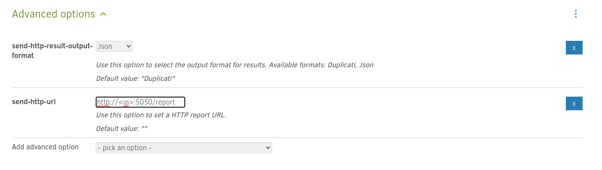

# Duplicati Monitor

Duplicati Monitor is a Rust-based application designed to monitor Duplicati backup operations and send notifications to a Gotify server. It supports running as a Docker container or directly as a compiled binary.

---

## Features

- Monitors Duplicati backup results and sends notifications to a Gotify server.
- Customizable notification messages based on backup results (success, warning, error).
- Supports configurable notification details via environment variables.
- Debug mode for verbose logging.

---

## Installation

### Running as a Docker Container

#### Prerequisites
- Docker installed on your system.

#### Steps to Run
1. Run the container using Docker with explicit environment variables:
   ```bash
   docker run -d \
       -p 5050:5050 \
       -e GOTIFY_SERVER_URL="<https://example.internal.org>" \
       -e GOTIFY_APP_TOKEN="AOF***-ZHx9u****" \
       -e GOTIFY_SUCCESS_MESSAGE="🟩 Backup succeeded!"  `# Optional: not recommended` \
       -e GOTIFY_WARNING_MESSAGE="🟨 Backup completed with warnings."  `# Optional: not recommended` \
       -e GOTIFY_ERROR_MESSAGE="🟥 Backup failed."   `# Optional: not recommended` \
       -e GOTIFY_MESSAGE_ITEMS=machine_name,parsed_result,duration `#Optional` \
       -e DEBUG_MODE=false  `#Optional` \
       ghcr.io/rodrigomaia06/duplicati_monitor:latest
   ```

2. The application will be available at port `5050`.

---

### Running as a Compiled Binary

#### Prerequisites
- Rust toolchain installed (for building from source).
- Linux environment with required libraries (`libssl-dev`, `libgcc-s1`, `libc6`).

#### Steps to Run
1. Clone the repository:
   ```bash
   https://github.com/rodrigomaia06/duplicati_monitor.git
   cd duplicati_monitor
   ```

2. Build the binary:
   ```bash
   cargo build --release
   ```

3. Run the binary with environment variables:
   ```bash
   GOTIFY_SERVER_URL="<https://example.internal.org>" \ `# Required`
   GOTIFY_APP_TOKEN="AOF***-ZHx9u****" \        `# Required`
   GOTIFY_SUCCESS_MESSAGE="🟩 Backup succeeded!" \  `# Optional: not recommended`
   GOTIFY_WARNING_MESSAGE="🟨 Backup completed with warnings." \  `# Optional: not recommended`
   GOTIFY_ERROR_MESSAGE="🟥 Backup failed." \  `# Optional: not recommended`
   GOTIFY_MESSAGE_ITEMS=machine_name,parsed_result,duration \ `# Optional`
   DEBUG_MODE=false \  `# Optional`
   ./target/release/duplicati_monitor
   ```

---

## Configuration

The application supports the following environment variables for customization:

| Variable                    | Description                                                                                   | Default Value                                                     | Required/Recommended                                                                 |
|-----------------------------|-----------------------------------------------------------------------------------------------|-------------------------------------------------------------------|-------------------------------------------------------------------------------------|
| **`GOTIFY_SERVER_URL`**     | The URL of the Gotify server.                                                                 | `https://example.internal.org`                             | **Required**                                                                        |
| **`GOTIFY_APP_TOKEN`**      | The Gotify app token for authentication.                                                     | `AOF***-ZHx9u****`                                                 | **Required**                                                                        |
| **`GOTIFY_SUCCESS_MESSAGE`**| Message sent for successful backups.                                                         | `💾🟢 Duplicati {operation-name}: {backup_name}`                   | **Recommendation**: Do not include in environment variables (use default).         |
| **`GOTIFY_WARNING_MESSAGE`**| Message sent for backups with warnings.                                                      | `💾🟡 Duplicati {operation-name}: {backup_name}`                   | **Recommendation**: Do not include in environment variables (use default).         |
| **`GOTIFY_ERROR_MESSAGE`**  | Message sent for failed backups.                                                             | `💾🔴 Duplicati {operation-name}: {backup_name}`                   | **Recommendation**: Do not include in environment variables (use default).         |
| **`GOTIFY_MESSAGE_ITEMS`**  | Comma-separated list of details to include in notifications.                                 | `backup_name,machine_name,operation_name,deleted_files,added_files,examined_files,size_of_added_files,main_operation,parsed_result,duration` | Optional                                                                          |
| **`GOTIFY_PRIORITY`**       | Priority level of Gotify notifications.                                                     | `10`                                                              | Optional                                                                            |
| **`DEBUG_MODE`**            | Enables verbose logging.                                                                     | `false`                                                           | Optional                                                                            |


## Setup Duplicati

Add theses two options for each backup you want to monitor:

- **send-http-result-output-format**: json
- **send-http-url**: http://**IP_ADDRESS**:**PORT**/report



## Debug Mode

Enable debug mode by setting `DEBUG_MODE=true` in the environment variables. This will log additional information, useful for troubleshooting.

---

## License

This project is licensed under the GPL-3 License. See the [LICENSE](LICENSE) file for details.

---

## Contact

For support or inquiries, contact the maintainer:  
**Rodrigo Maia**  
<rodrigo.m.t.maia@gmail.com>
